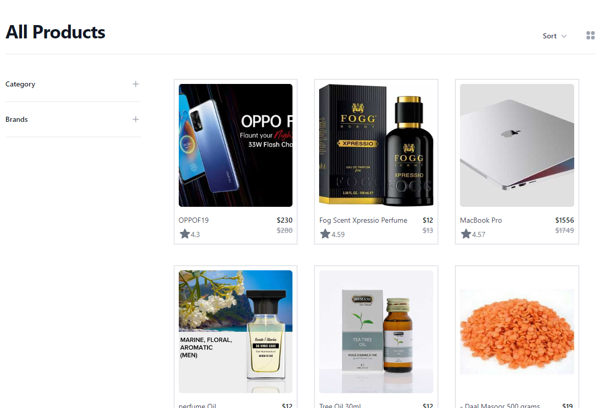
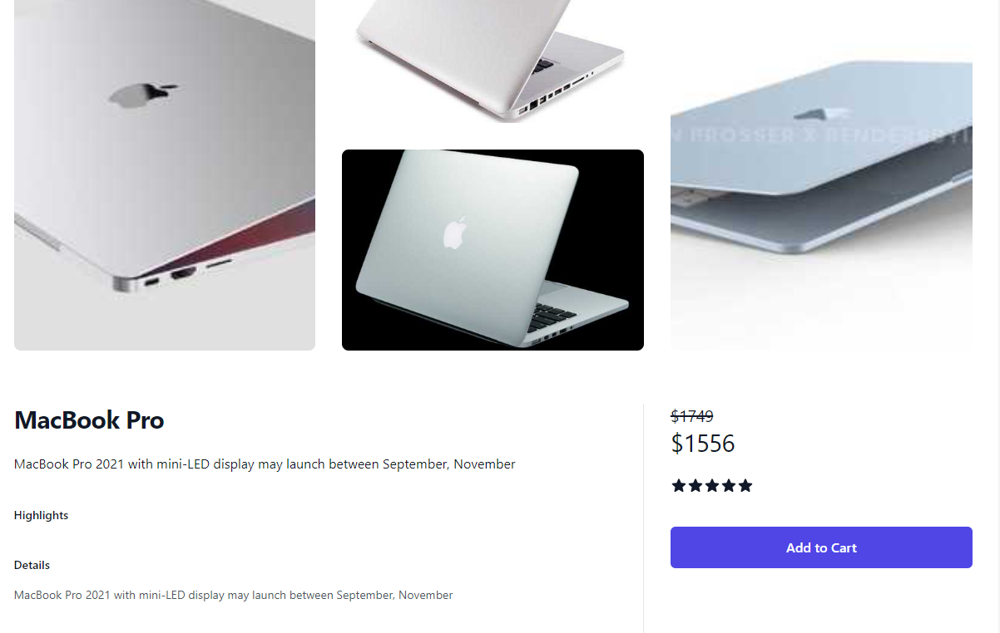
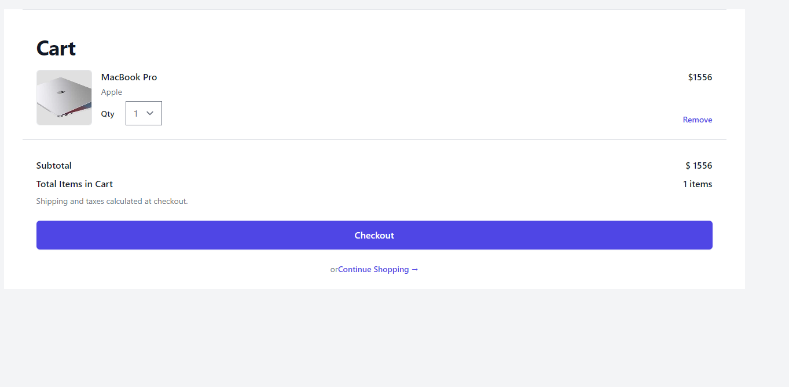
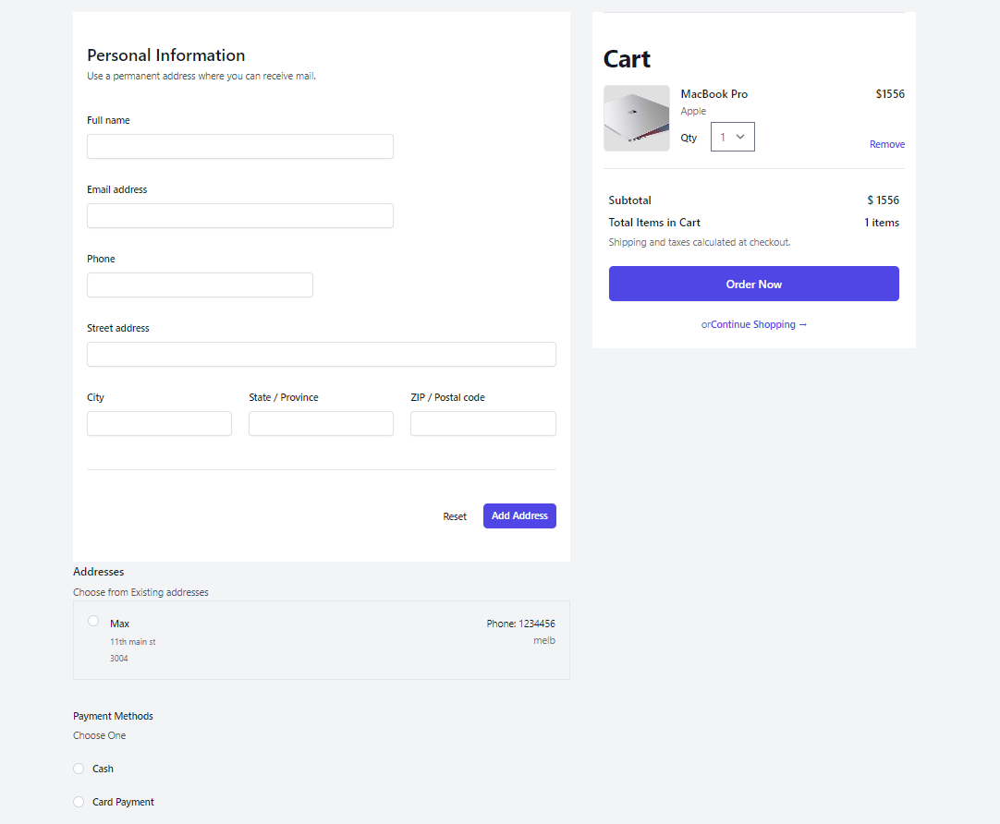

# MERN E-commerce Full Stack Application

A full stack web application build with MERN stack including Redux-toolkit, Stripe, Nodemailer.

# Functionality of this app

- Ecommerce web application where business list and manage products through CRUD operations, accept payments by Stripe and can email invoice receipt to customer upon checkout. Customer can sign up and login with secure authorization and can reset password by receiving reset password link in registered email.

# Installation

- to run in locally for education purpose
- Download or clone repository of [MERN Frontend](https://github.com/kartavya99/MERN-ecommerce-Frontend) & [MERN Backend](https://github.com/kartavya99/mern-ecommerce-backend)
- Node.js is required to run the application
- npm install to install the required packages as per package.json

# Usage

- use the following link to open the application
- The application will run on any browser.

# live application

[Ecommerce Application deployed link](https://mern-ecommerce-one-navy.vercel.app)

# Below are the sample images of deployed application

## Home Page

## Single Product Page

## Shopping Cart Page

## Checkout Page

# Features and Technologies uses

- MongoDB
- Express.Js
- React.js
- Node.js
- REST API
- Redux-toolkit
- AsyncThunks
- Stripe Integration with webhook
- Nodemailer
- passportJS
- jsonwebtoken

## Under the MIT license

